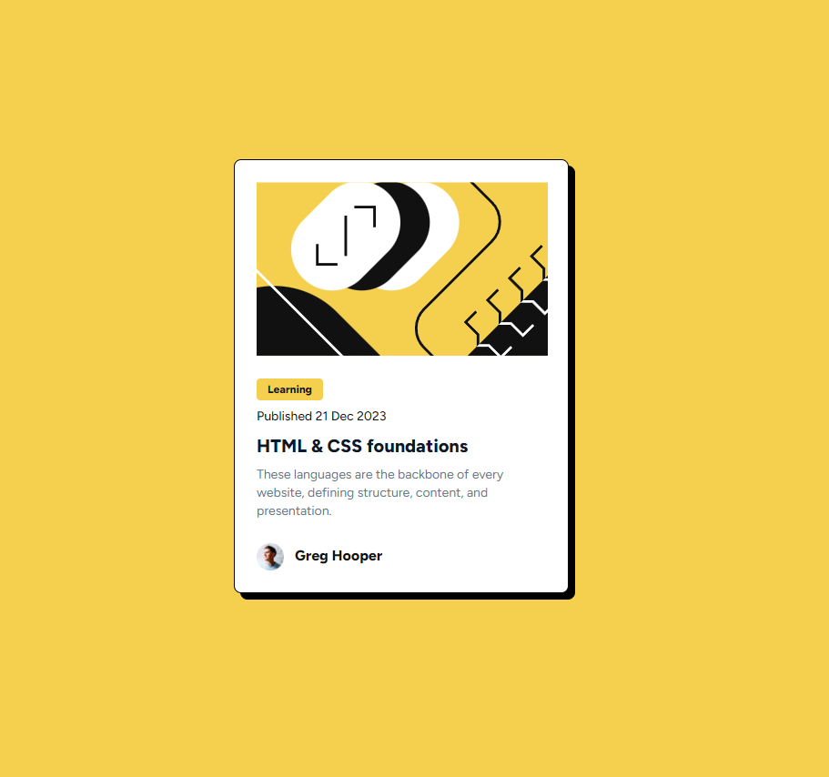

# Frontend Mentor - Blog preview card solution

This is a solution to the [Blog preview card challenge on Frontend Mentor](https://www.frontendmentor.io/challenges/blog-preview-card-ckPaj01IcS). Frontend Mentor challenges help you improve your coding skills by building realistic projects.

## Table of contents

- [Overview](#overview)
  - [The challenge](#the-challenge)
  - [Screenshot](#screenshot)
  - [Links](#links)
- [My process](#my-process)
  - [Built with](#built-with)
  - [What I learned](#what-i-learned)
- [Author](#author)

**Note: Delete this note and update the table of contents based on what sections you keep.**

## Overview

### The challenge

Users should be able to:

- See hover and focus states for all interactive elements on the page

### Screenshot

### Links

- Solution URL: [github](https://github.com/njpoli/Blog-Preview-Card)
- Live Site URL: [vercel](https://blog-preview-card-flame-one.vercel.app/)

## My process

### Built with

- [React](https://reactjs.org/) - JS library
- [Next.js](https://nextjs.org/) - React framework
- [shadcn/ui](https://ui.shadcn.com/) - Component library

### What I learned

This time I wanted to implement a dark mode as I've never done it before. It
actually was fairly painless using shadcn's documentation on implementing dark mode
in next.js.

## Author

- Website - [njpoli](https://github.com/njpoli)
- Frontend Mentor - [@njpoli](https://www.frontendmentor.io/profile/njpoli)
